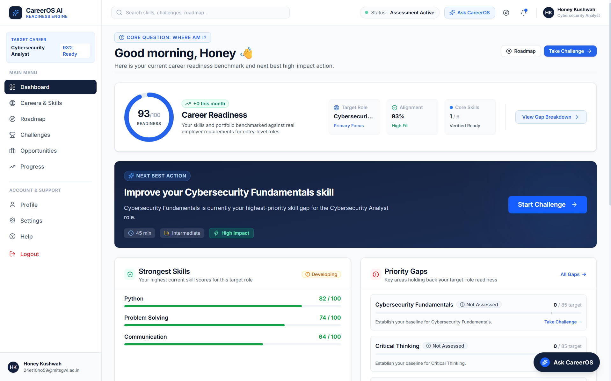
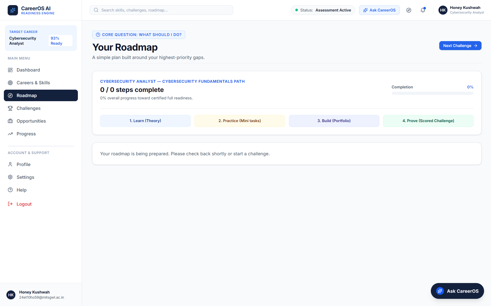
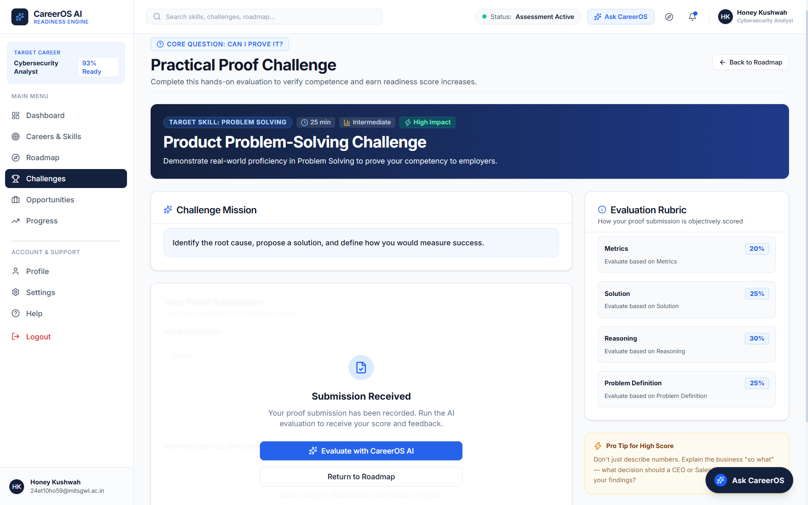
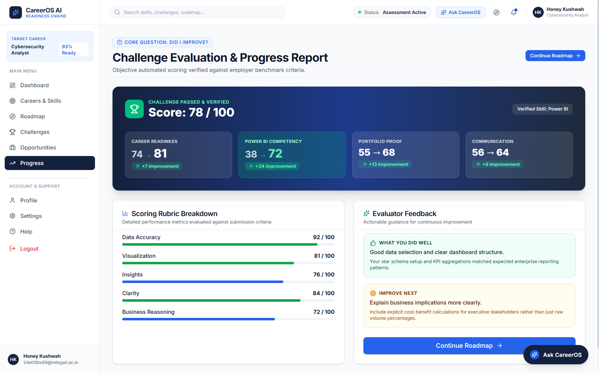
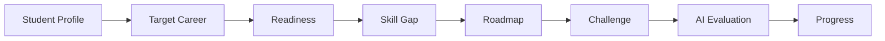
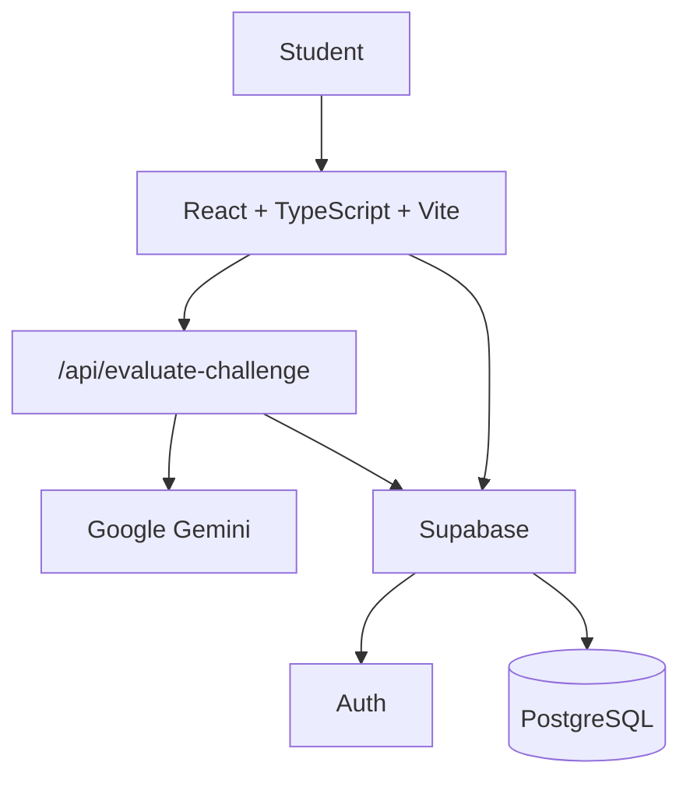
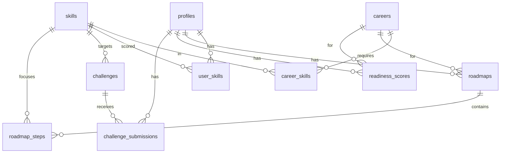

<p align="center">
  
</p>

<h1 align="center">CareerOS AI</h1>

<p align="center"><strong>“Know where you stand. Know what to do next.”</strong></p>

<p align="center">AI-Powered Career Readiness &amp; Employability Platform</p>

<p align="center">
  CareerOS AI shows students their current readiness for a target career, isolates missing skills, builds a short personalized roadmap, and lets them submit a practical challenge that is scored by Gemini.
</p>

<p align="center">
  <a href="https://careersos-ai.vercel.app"><strong>Live Demo</strong></a>
  &nbsp;·&nbsp;
  <a href="https://github.com/Anmol0224/careersos-ai"><strong>GitHub</strong></a>
</p>

<p align="center">
  
  
  
  
  
  
</p>

## Why CareerOS

CareerOS is built around one loop:

**Assessment → Readiness → Skill Gap → Roadmap → Challenge → Evidence → Progress**

It does not stop at “what to learn.” It connects **gaps** to **actions**, **challenges**, **evaluation**, and **progress**.

## The Problem

- Students may know the career they want.
- They often do not know their **current readiness**.
- They often do not know **which skills are missing**.
- Generic courses are not a **personalized path**.
- They need a practical way to **demonstrate** skills and **see** progress.

## Our Solution

One product for profile, target role, required skills, readiness, gaps, roadmap, and proof challenges.

```text
Student Profile → Target Career → Required Skills → Current Skill State
    → Readiness → Skill Gap → Personalized Roadmap
    → Practical Challenge → AI Evaluation → Progress
```

## Key Features

| | Feature | In this build |
| --- | --- | --- |
| Auth | Email/password via Supabase; protected app routes | Yes |
| Profile | Onboarding (name, education, interests, target career) saved to `profiles` | Yes |
| Career mapping | Role mapped to required skills in the database | Yes |
| Readiness | Deterministic score from **assessed** skills vs. required scores | Yes |
| Skill gaps | Current vs. required, status, priority ranking | Yes |
| Roadmap | Learn → Practice → Build → Prove; step completion persisted | Yes |
| Challenges | Career-aligned practical task from `challenges` | Yes |
| AI evaluation | Gemini scores the written submission against the rubric | Yes |
| Progress | Dashboard readiness, roadmap %, profile skills, stored scores | Yes |

**Not claimed as live AI/data:** sample job listings, scripted “Ask CareerOS” replies, resume file parsing, and the Progress page’s illustrative report (live Gemini output is stored on `challenge_submissions`).

## Product Walkthrough

### Dashboard

Readiness, next action, strongest skills, and priority gaps.

<p align="center">
  
</p>

### Career & Skill Gap

Required skills vs. current scores for the target role.

<p align="center">
  
</p>

### Personalized Roadmap

Four-step plan around the highest-priority gap.

<p align="center">
  
</p>

### Practical Challenge

Mission, rubric, written response, submit, and evaluate.

<p align="center">
  
</p>

### Progress

Challenge evaluation / progress report view.

<p align="center">
  
</p>

## How CareerOS Works



1. Sign in and complete onboarding.
2. Dashboard shows readiness and a next action.
3. Career & Skills ranks gaps against the role.
4. Roadmap is generated for the top gap; steps can be marked complete.
5. Challenge is selected for a priority skill; the student submits text.
6. Evaluation writes score and feedback to the submission record.

## AI Evaluation

Gemini is used **only** for practical-challenge scoring — not for readiness math, gap ranking, or roadmap generation.

```text
Student submits practical challenge
    ↓
POST /api/evaluate-challenge  (user JWT required)
    ↓
Gemini returns structured rubric scores + feedback
    ↓
Server computes overall score from rubric weights
    ↓
Saved on challenge_submissions  (score, evaluation JSON, status)
```

The API verifies the user, loads their submission, marks it evaluating, calls Gemini with the challenge rubric and text, then stores `ai_score`, `evaluation`, `feedback`, and `evaluated_at`. Keys stay in environment variables — never in the client bundle.

## Technical Architecture



| Piece | Role |
| --- | --- |
| Frontend | UI, routing, calls Supabase with the user session |
| Vite | Local app + local handler for `/api/evaluate-challenge` |
| Vercel function | Same API in production |
| Gemini | Rubric-based evaluation of submission text |
| Supabase | Auth + application data |

## Data Architecture

Tables **referenced in code** (no unused names):

| Table | Role |
| --- | --- |
| `profiles` | Student profile; `id` is the auth user id; `career_goal` selects the role |
| `careers` | Target roles (`name`, `slug`) |
| `skills` | Skill catalog |
| `career_skills` | Required score per career × skill |
| `user_skills` | Student scores, evidence fields, source |
| `readiness_scores` | Persisted readiness snapshots |
| `roadmaps` | One active plan per user × career |
| `roadmap_steps` | Learn / Practice / Build / Prove steps |
| `challenges` | Practical tasks keyed by `skill_id` |
| `challenge_submissions` | Text, status, Gemini result |

`profiles.career_goal` is matched to `careers.slug` in application code (not a database foreign key in the client).



## Technology Stack

| Category | Stack |
| --- | --- |
| Frontend | React 19, TypeScript |
| Build | Vite 8 |
| Styling | Tailwind CSS 4 |
| Routing | React Router 7 |
| Icons | Lucide React |
| API | Vercel Node (`api/evaluate-challenge.ts`) |
| Database | Supabase PostgreSQL |
| Auth | Supabase Auth |
| AI | Google Gemini (`@google/genai`) |
| Hosting | Vercel |
| VCS | Git / GitHub |

## Project Structure

```text
careersos-ai/
├── api/                 # Serverless challenge evaluation
├── docs/screenshots/    # README product screenshots
├── public/              # Favicon and static icons
├── src/
│   ├── components/      # Layout, UI, dashboard, skills, roadmap, challenges
│   ├── context/         # Auth session provider
│   ├── data/            # Shared types and sample listing/report data
│   ├── hooks/           # Shell profile for the app chrome
│   ├── lib/             # Supabase client and helpers
│   ├── pages/           # Routes (landing, auth, onboarding, app)
│   └── services/        # Profile, dashboard, career, readiness
├── README.md
├── package.json
└── vite.config.ts
```

## Quick Start

```bash
git clone https://github.com/Anmol0224/careersos-ai.git
cd careersos-ai
npm install
```

Create **`.env.local`** from `.env.example`. Placeholders only:

```bash
# Frontend (Vite)
VITE_SUPABASE_URL=
VITE_SUPABASE_PUBLISHABLE_KEY=

# API (evaluate-challenge) — also used when Vite loads the handler locally
SUPABASE_URL=
SUPABASE_ANON_KEY=
GEMINI_API_KEY=
```

```bash
npm run dev
```

Open the local URL Vite prints (usually `http://localhost:5173`).

**`/api/evaluate-challenge`:** `npm run dev` serves this route through Vite (see `vite.config.ts`). You do **not** need the Vercel CLI for local evaluation. Production uses the Vercel serverless function. Evaluation still needs valid `SUPABASE_*` and `GEMINI_API_KEY` values.

| Script | Purpose |
| --- | --- |
| `npm run dev` | App + local evaluate API |
| `npm run build` | Typecheck and production build |
| `npm run preview` | Preview the build |
| `npm run lint` | ESLint |

## Demo Account

| | |
| --- | --- |
| **Live demo** | https://careersos-ai.vercel.app |
| **Email** | `demo@careeros.ai` |
| **Password** | `CareerOS@2026!` |

Sign in, or use **Try Demo Account** on the login page.

## Security & Environment

- Put secrets only in environment variables — never in source or the README besides this demo login.
- Keep **`.env`**, **`.env.local`**, and **`.vercel`** out of git (see `.gitignore`).
- Commit **`.env.example`** with empty/placeholder values only.
- On Vercel, set the same variable names under Project → Settings → Environment Variables.

## Deployment

The app is deployed on **Vercel** as a Vite frontend plus `api/evaluate-challenge.ts`.

Production: **https://careersos-ai.vercel.app**

Typical flow: import the GitHub repo in Vercel, set the env vars above, deploy. No extra build command beyond the project’s `npm run build`.

## Project Status

- [x] Authentication
- [x] Career selection
- [x] Readiness
- [x] Skill gap analysis
- [x] Roadmap
- [x] Practical challenge
- [x] AI evaluation
- [x] Progress tracking
- [x] Cloud deployment

## Future Scope

These are **not** implemented as product features today:

- Resume-based skill extraction
- Real opportunity matching (listings are sample data)
- Institution-level analytics
- Interview readiness as a scored component
- Career trend intelligence
- Broader evidence verification (file/portfolio pipelines)
- Multilingual support

## Team

| Name | Viksit Bharat |
| --- | --- |
| Anmol | [github.com/Anmol0224](https://github.com/Anmol0224) |

## License

[MIT](LICENSE)
